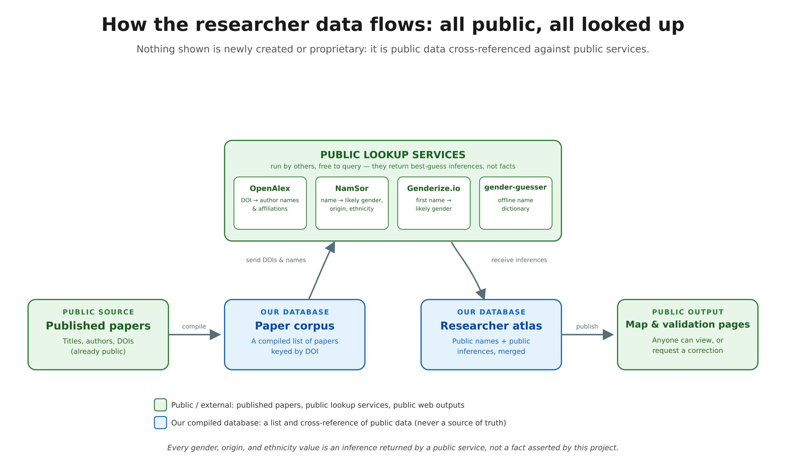

# Elasmobranch Analytical Methods Review

**A systematic review of the analytical techniques used across shark, ray, and chimaera research.**

[](https://creativecommons.org/licenses/by/4.0/)

---

## What is this?

Elasmobranch science (sharks, rays, and chimaeras) spans dozens of methods, from age-and-growth histology to acoustic telemetry to environmental DNA. No one has systematically mapped **which techniques are used, where, by whom, and how that has changed over 75 years**. This project does exactly that.

We assembled a near-complete corpus of elasmobranch literature (~30,500 papers, 1950–present), acquired the full-text PDFs, and ran an automated pipeline that reads each paper and records what analytical approaches, ecosystems, pressures, gear, and study locations it involves. The result is a queryable database of the field's methodological history, plus author, geography, and citation-impact enrichment layered on top.

The work began as a panel session at the **European Elasmobranch Association (EEA) Conference 2025** in Rotterdam, and is intended to become a **living database**, updated annually.

**New here? Start with the [results index](docs/results.html)** — live links to the interactive Author Atlas, the collaboration network, key figures, and the validation report.

**Want the tour?** The [slide deck with speaker notes](https://simondedman.github.io/elasmo_analyses/slides/) walks through the whole project in 17 slides, each with the notes spoken alongside it, so the argument reads end to end without the talk. Also available as a [PDF](https://simondedman.github.io/elasmo_analyses/slides/elasmo_analyses_slides.pdf).

---

## The corpus at a glance

| Metric | Value |
|--------|-------|
| Papers catalogued | ~30,500 |
| Full-text PDFs acquired | ~20,000 |
| Extraction columns | 123 binary (6 schemas) |
| Evidence rows (audit trail) | ~275,000 across 18,200+ papers |
| Unique authors (OpenAlex) | ~28,950 |
| Species columns | ~1,300 |
| Techniques in taxonomy | 208 |

*Numbers are approximate and grow with each monthly sync. Precise current figures and the full as-built pipeline live in the [pipeline overview](docs/core/pipeline_overview.md).*

---

## How it works — the pipeline

The project is an as-built data pipeline. Each stage has a dedicated script; the arrows show the flow from a bare citation to an answerable question.

[](docs/results_figures/researcher_data_pipeline_infographic.pdf)

*The pipeline at a glance ([PDF](docs/results_figures/researcher_data_pipeline_infographic.pdf), [SVG](docs/results_figures/researcher_data_pipeline_infographic.svg)). The stages below expand each step.*

**1. Acquire.** `scripts/acquire_cascade.py` is the unified acquisition entry point. Given a paper, it tries each source in turn (open-access resolvers, DOI recovery, the Biodiversity Heritage Library, Unpaywall) until it finds the PDF. `finalize_acquisitions()` then chains ingest → verified-delete → incremental extraction so a newly-found paper flows straight into the database. Monthly top-ups come from `scripts/sync_shark_references.py` (an anacron job that crawls Shark-References, downloads new papers, and re-extracts).

> This unifies what used to be dozens of per-source download scripts. If you find older `download_*` / manual-download / Sci-Hub / Tor guides under `docs/database/`, they're superseded by the cascade — see the design spec at [`docs/superpowers/specs/2026-07-07-cascade-finalize-ingest-extract-design.md`](docs/superpowers/specs/2026-07-07-cascade-finalize-ingest-extract-design.md).

**2. OCR.** Scanned and historical PDFs are made text-searchable so the extractor can read them: screen (`find_non_extractable_pdfs.py`) → OCR (`ocr_library.py`, per-file language) → verify. See the [OCR pipeline guide](docs/database/ocr_processing_guide.md).

**3. Extract.** `scripts/extract_schema_columns.py` reads each PDF's text and scores it against **123 binary columns across 6 schemas** (discipline, ecosystem, pressure, gear, impact, ocean basin) using keyword-plus-context matching with section-weighted scoring. Every classification is backed by a quote in the evidence table. See [extraction logic](docs/schema_proposals/extraction_logic.md).

**4. Enrich.** Authors (OpenAlex + NamSor for gender/origin), citation impact (Altmetric), journal quality (SCImago), and geography are joined on. See the enrichment proposals under [`docs/schema_proposals/`](docs/schema_proposals/).

**5. Analyse.** The `scripts/viz_*.R` suite produces the temporal, spatial, and cross-cutting figures; the [Author Atlas](docs/network_atlas/) maps the collaboration network.

**6. Ask.** A local retrieval-augmented-generation (RAG) prototype (BGE-small embeddings + FAISS + Ollama, all CPU-local and private) lets you query the corpus in natural language. See [RAG prototype status](docs/LLM/rag_prototype_status.md).

---

## The 8 disciplines

1. **Biology, Life History, & Health (BIO)** — age/growth, reproduction, physiology, anatomy, disease
2. **Behaviour & Sensory Ecology (BEH)** — behavioural observation, social structure, sensory biology
3. **Trophic & Community Ecology (TRO)** — diet analysis, trophic position, food webs
4. **Genetics, Genomics, & eDNA (GEN)** — population genetics, phylogenetics, genomics, environmental DNA
5. **Movement, Space Use, & Habitat Modelling (MOV)** — telemetry, movement models, species distribution models
6. **Fisheries, Stock Assessment, & Management (FISH)** — stock assessment, CPUE standardisation, bycatch
7. **Conservation Policy & Human Dimensions (CON)** — IUCN assessments, policy, human-wildlife conflict
8. **Data Science & Integrative Methods (DATA)** — statistical frameworks, machine learning, reproducibility

---

## What we extract — the schema

Six schema categories extract binary classifications from each PDF. Fully implemented and run across the corpus.

| Category | Prefix | Columns | Proposal |
|----------|--------|---------|----------|
| Discipline | `d_` | 19 | [discipline_proposal.md](docs/schema_proposals/discipline_proposal.md) |
| Ecosystem | `eco_` | 20 | [ecosystem_component_proposal.md](docs/schema_proposals/ecosystem_component_proposal.md) |
| Pressure / Threat | `pr_` | 26 | [pressure_proposal.md](docs/schema_proposals/pressure_proposal.md) |
| Fishing Gear | `gear_` | 28 | [gear_proposal.md](docs/schema_proposals/gear_proposal.md) |
| Impact / Response | `imp_` | 21 | [impact_proposal.md](docs/schema_proposals/impact_proposal.md) |
| Ocean Basin | `b_` | 9 | [ocean_basin_proposal.md](docs/schema_proposals/ocean_basin_proposal.md) |

Pipeline internals: [extraction_logic.md](docs/schema_proposals/extraction_logic.md). Known false-positive patterns: [extraction_quality_issues.md](docs/schema_proposals/extraction_quality_issues.md). Column-design discussion: [Issue #2](https://github.com/SimonDedman/elasmo_analyses/issues/2).

---

## Repository layout

```
docs/            Documentation (see docs/readme.md for the index)
  core/            Master plan & current status
  schema_proposals/  Extraction column design + logic (the analytical core)
  database/        Schema, extraction, acquisition, OCR
  superpowers/     Current design specs (cascade, RAG, validation loop)
  integrations/    Sharkipedia, MegaMove, Altmetric
  network_atlas/   Deployed interactive Author Atlas
scripts/         Acquisition, OCR, extraction, enrichment, viz, RAG
database/        SQLite databases (technique taxonomy + tracking)
outputs/         Generated data: enriched parquet, analysis CSVs, figures, validation XLSX
data/            Input & integration data (Sharkipedia, SCImago)
```

---

## Project status

**Phase: validation & analysis** (2026). Acquisition, OCR, schema extraction, and author/citation/geography enrichment are complete and running on a monthly cycle. Current focus:

- **Validation** — an automated loop scores the rule-based extractor against human-reviewed and LLM-oracle labels; the first rule-improvement round is complete ([report](docs/validation_and_rule_improvement_report.md)). The community validation UI is live: **[search for your papers and review the extraction](https://simondedman.github.io/elasmo_analyses/validate/)**.
- **Analysis** — temporal trends, discipline × pressure heatmaps, geographic and parachute-science dashboards, species × discipline gaps.
- **RAG frontend** — natural-language querying of the corpus (prototype live).
- **Next** — methods manuscript and public database release.

---

## For contributors

Contributions from the elasmobranch research community are welcome:

1. **Validate extraction results** — search for your papers on the [validation site](https://simondedman.github.io/elasmo_analyses/validate/) and check false positives/negatives; each correction opens a pull request for the schema lead to review.
2. **Review schema columns** — suggest rule changes for missed or over-called techniques.
3. **Share missing papers** — contribute PDFs via [Shark-References](https://shark-references.com/).

See [CONTRIBUTING.md](CONTRIBUTING.md).

---

## Citation

```
Dedman, S., Tiktak, G., et al. (2025). Elasmobranch Analytical Methods Review:
A systematic extraction of analytical techniques from the elasmobranch
literature (1950–2025). European Elasmobranch Association Conference 2025,
Rotterdam, Netherlands. https://github.com/SimonDedman/elasmo_analyses
```

---

## Team

**Leads:** Dr. Simon Dedman (simondedman@gmail.com, [GitHub](https://github.com/SimonDedman)) & Dr. Guuske Tiktak.

**Collaborators:** David Ruiz Garcia (Mediterranean fisheries; schema proposals), David Schiffman (citation/social analysis), Elena Fernández Corredor (Mediterranean trophic review), Jürgen Pollerspöck & Nico Straube ([Shark-References](https://shark-references.com/)).

---

## Licence & acknowledgements

Licensed under [CC BY 4.0](https://creativecommons.org/licenses/by/4.0/).

Builds on the work of thousands of researchers worldwide, the [Shark-References](https://shark-references.com/) literature repository, [Sharkipedia](https://sharkipedia.org/) trait data, and the EEA and AES conference communities.

---

*Last updated: 2026-07-21*
